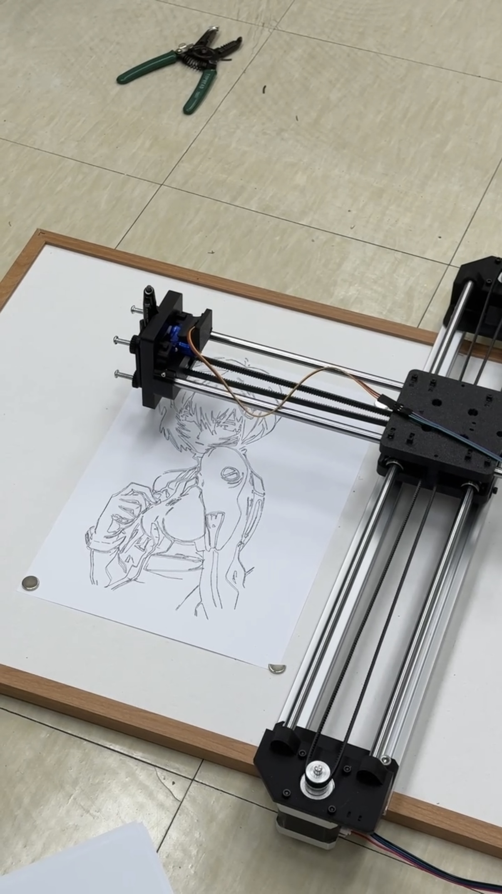
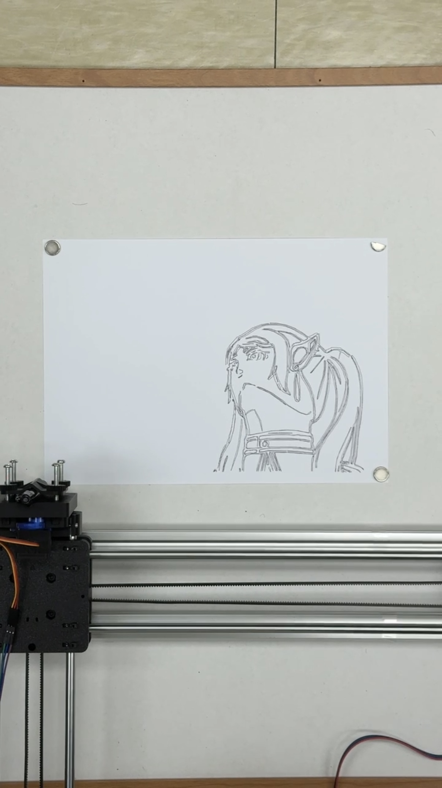

# XY Plotter Image-to-G-code Tool

이미지의 외곽선을 추출해 A4 가로 방향 XY 플로터용 G-code로 변환하는 Python 도구입니다.

## 제작 배경

XY 플로터의 하드웨어 조립과 초기 설정은 아래 네이버 블로그 가이드를 참고해 진행했습니다.

- [XY 플로터 제작 가이드-1 하드웨어](https://m.blog.naver.com/kimgooni/221493177996)
- [XY 플로터 제작 가이드-2 소프트웨어](https://m.blog.naver.com/kimgooni/221235842572)

위 가이드의 방식만으로는 원하는 이미지에서 외곽선을 추출해 G-code로 변환하는 과정에 제한이 있어, 임의의 이미지에서 Canny edge를 검출하고 플로터 경로로 변환할 수 있도록 이 프로그램을 제작했습니다.

## 작동 모습



이미지에서 추출한 외곽선을 따라 플로터가 그림을 그리는 모습입니다.

## 주요 기능

- PNG, JPG, JPEG, BMP, WebP 이미지 불러오기
- Canny 기반 외곽선 검출 및 실시간 미리보기
- Gaussian blur, 외곽선 임곗값, 최소 경로 길이, 경로 단순화 정도 조절
- morphology close를 이용한 끊긴 외곽선 보정
- 90도 단위 이미지 회전 및 출력 크기 조절
- Gradient Otsu 및 목표 edge density 기반 Canny 임곗값 자동 설정
- 검출된 외곽선을 A4 가로 방향 좌표계(mm)로 변환
- 용지 밖 경로의 클리핑·제거 및 출력 전 안전 검사
- 펜 이동 거리를 줄이기 위한 가까운 경로 우선 정렬
- 이동 속도와 그리기 속도 조절
- 원본 이미지, 검출 외곽선, 실제 G-code 경로를 한 화면에서 비교

## 환경

- Python 3
- OpenCV
- NumPy
- Tkinter

Windows용 Python에는 보통 Tkinter가 함께 설치됩니다. OpenCV와 NumPy는 다음 명령으로 설치할 수 있습니다.

```bash
python -m pip install opencv-python numpy
```

## 사용법

1. 프로그램을 실행합니다.

   ```bash
   python isaac_xyprinter.py
   ```

2. 파일 선택 창에서 변환할 이미지를 선택합니다.
3. 미리보기를 보면서 창 상단의 trackbar를 조절합니다.
4. 결과가 적절하면 `g` 키를 눌러 G-code를 생성합니다.
5. 입력 이미지와 같은 폴더에 같은 이름의 `.gcode` 파일이 저장됩니다.

### 키보드 조작

| 키 | 기능 |
| --- | --- |
| `a` | Gradient Otsu 방식으로 Canny 임곗값 자동 설정 |
| `d` | 목표 edge density 방식으로 Canny 임곗값 자동 설정 |
| `g` | 현재 설정으로 G-code 생성 |
| `q` 또는 `Esc` | 프로그램 종료 |

### 주요 조절 항목

| 항목 | 설명 |
| --- | --- |
| `Canny low`, `Canny high` | 외곽선 검출 임곗값 |
| `Blur` | Gaussian blur 강도 |
| `Min length` | 이 값보다 짧은 외곽선 제거 |
| `Simplify x10` | 외곽선 경로 단순화 정도 |
| `Close` | 끊어진 외곽선을 연결하는 보정 횟수 |
| `Size %` | A4 출력 가능 영역 안에서 그림 크기 조절 |
| `Rotate 90` | 0°, 시계 방향 90°, 180°, 반시계 방향 90° 회전 |
| `Travel F` | 펜을 든 상태의 이동 속도 |
| `Draw F` | 펜을 내린 상태의 그리기 속도 |

## 플로터 설정과 주의사항

- 이 코드는 A4 용지를 **반드시 가로 방향**으로 놓고 사용하는 것을 기준으로 합니다. 용지의 긴 변이 가로축이 되도록 배치하십시오.
- 세로로 긴 이미지를 그리고 싶을 때도 용지를 세로로 돌리지 마십시오. 프로그램의 `Rotate 90` 기능으로 이미지를 90도 회전해 사용하면 됩니다.
- 프로그램은 A4 용지 왼쪽 아래 모서리를 `(0, 0)`으로 사용하며, 시작할 때 현재 위치를 원점으로 설정하는 `G92 X0 Y0`을 출력합니다.
- 실행 전 펜 끝을 A4 용지의 왼쪽 아래 모서리에 정확히 맞춰야 합니다. 원점이 어긋나면 그림이 용지 밖으로 벗어나기 쉽습니다.
- 그림이 용지 밖으로 벗어나는 것을 방지하려면 `Size %`를 조금 낮춰 그림 크기를 작게 조절하는 것도 좋은 방법입니다.



위 사진처럼 작업 시작 전 펜의 원점을 A4 용지 왼쪽 아래 모서리에 맞춥니다.

- 기본 펜 명령은 다음과 같습니다.

  - 펜 내리기: `M05 S255`
  - 펜 올리기: `M03 S40`

- 펜 명령과 feed rate의 실제 동작은 사용하는 컨트롤러 펌웨어 및 기구 설정에 따라 다를 수 있습니다. 장비에 맞지 않으면 소스 상단의 `PEN_DOWN_CMD`, `PEN_UP_CMD`, 속도 값을 수정해야 합니다.
- 처음 실행할 때는 펜을 제거하거나 충분히 들어 올린 상태에서 낮은 속도로 이동 범위와 방향을 먼저 확인하십시오.

## 처리 과정

```text
이미지 선택
  → 회색조 변환 및 회전
  → blur / Canny edge 검출
  → contour 추출 및 경로 단순화
  → A4 좌표(mm)로 변환
  → 용지 범위 밖 경로 클리핑
  → 가까운 경로 우선 정렬
  → G-code 저장
```

## 현재 제한사항

- A4 가로 방향 출력에 맞춰져 있습니다. 다른 용지 크기는 소스의 상수를 수정해야 합니다.
- 선의 굵기나 명암을 표현하지 않고 검출된 외곽선을 단일 펜 경로로 변환합니다.
- 복잡하거나 노이즈가 많은 이미지에서는 trackbar를 직접 조절해야 원하는 결과를 얻을 수 있습니다.
- 생성된 G-code를 장비로 직접 전송하지는 않으며, 별도의 G-code sender가 필요합니다.
